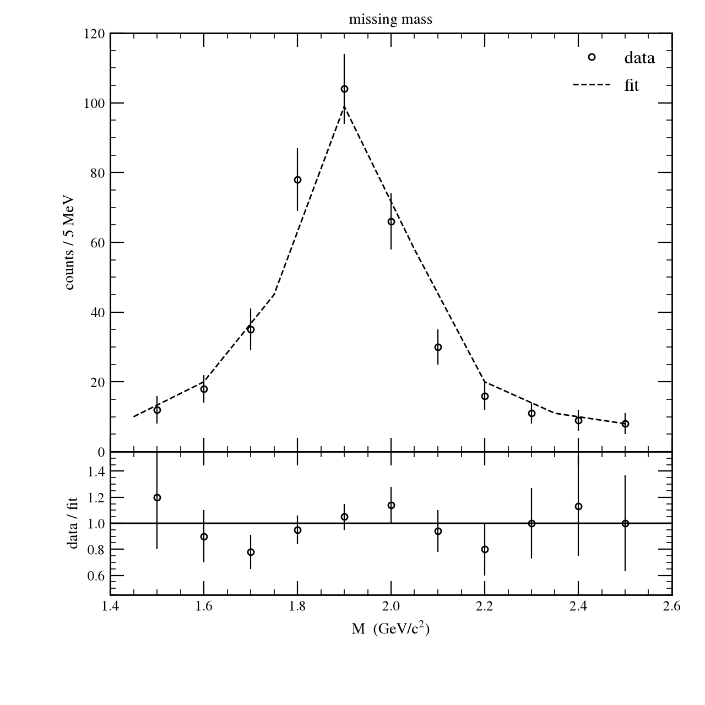
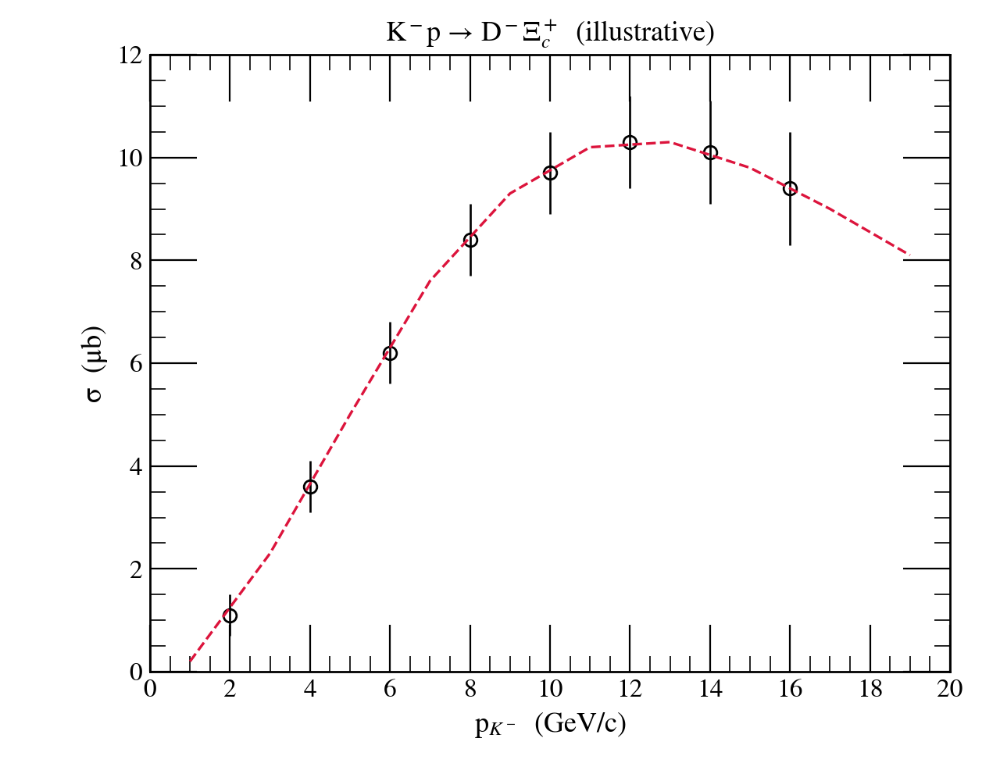
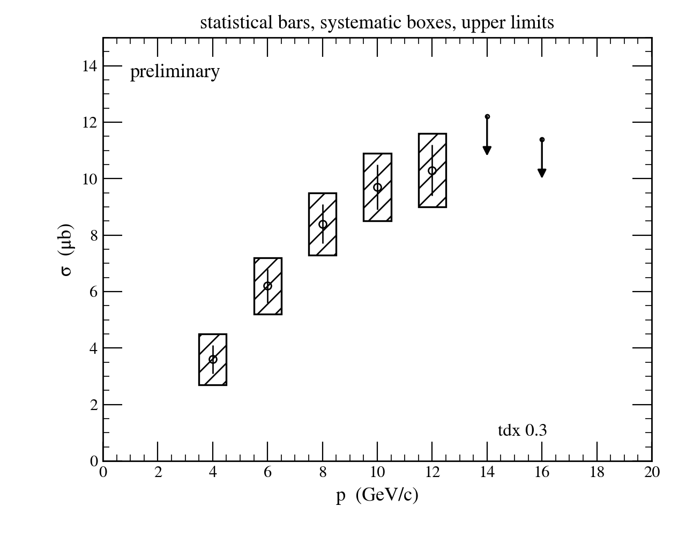
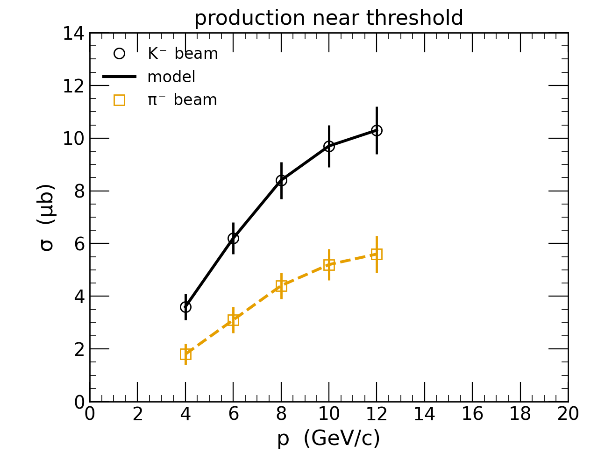
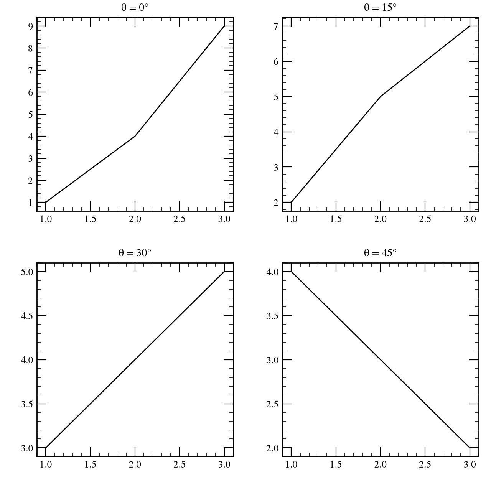
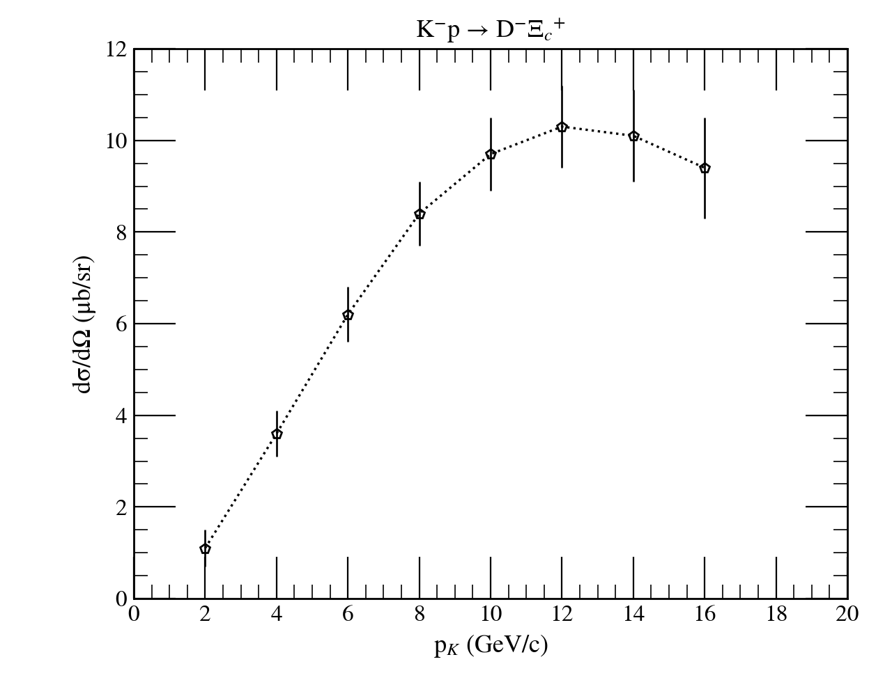

# topdrawerx

[](https://github.com/KenSuzukiRCNP/topdrawerx/actions/workflows/tests.yml)
[](https://pypi.org/project/topdrawerx/)
[](https://pypi.org/project/topdrawerx/)
[](LICENSE)

**A small command language for making publication figures — and the REPL to
go with it.** Type a few lines, get a figure. The file stays readable, the
session *is* the script, and the defaults are the ones a physics journal wants.

The package is `topdrawerx`; the command you type is `tdx`.

```
SET ORDER X Y DY
 2.0   1.1   0.4
 4.0   3.6   0.5
 6.0   6.2   0.6
PLOT
JOIN DASHES
TITLE LEFT 'σ  (μb)'
TITLE BOTTOM '$p_{K^-}$  (GeV/c)'
```



The grammar is TopDrawer's — SLAC's plotting program from the late 1970s, which
a generation of particle physicists typed at daily and a few of us still miss.
topdrawerx keeps what made it pleasant, drops what only existed to serve card
readers and pen plotters, and renders through matplotlib.

## Why you might want it

**The session is the script.** Type at the prompt, watch the figure change, then
`SAVE work.tdx` — and that file reproduces the figure exactly, next year, on
another machine. Settings apply retroactively: `SET SCALE Y LOG` after you have
already plotted does the right thing, and `UNDO` works, because every command is
replayed from a log rather than smeared onto a canvas.

**The defaults are already right for a paper.** Black on white, serif, ticks
inward on all four sides, error bars without caps, 1/2/5 tick intervals. You are
not spending your afternoon undoing someone's idea of a pretty chart.

**Physics figures are one command each.** Systematic error boxes are `BOX` over
data with `DX`/`DY` columns. Upper limits are `ARROW DOWN`. A ratio panel under a
spectrum, sharing the axis, is two `SET WINDOW`s.

**It is small.** One dependency (matplotlib), about thirty commands, a plain-text
file format your colleague can read without installing anything.

## Install

```sh
pip install topdrawerx          # or: pip install "topdrawerx[repl]"
```

Python ≥ 3.10, matplotlib ≥ 3.7. The optional `[repl]` extra adds line editing
and completion via `prompt_toolkit`.

## A minute with it

```sh
tdx                          # interactive, with a live plot window
tdx figure.tdx               # run a file, then stay interactive
tdx figure.tdx -o fig.pdf    # batch: run it and write the figure
tdx --check old/*.top        # what would these legacy files need?
```

At the prompt:

```
tdx> SET ORDER X Y DY
tdx> 2.0 1.1 0.4
tdx> 4.0 3.6 0.5
tdx> 6.0 6.2 0.6
tdx> PLOT
tdx> JOIN
tdx> SET SCALE Y LOG          ← applies to what you already drew
tdx> LEGEND 'K⁻ beam'
tdx> SAVE 'fig.pdf'           ← or SAVE 'work.tdx' for the script
```

The output format comes from the file name — `.pdf`, `.png`, `.svg`. There is no
device to configure. Several pages going to a PDF become one multi-page file.

From Python, the same engine:

```python
import topdrawerx as tdx

s = tdx.Session()
s.run(open("figure.tdx").read())
fig = tdx.figure(s.frame)          # a real matplotlib Figure, yours to adjust
tdx.save(s.frames, "out.pdf")
```

## Gallery

Every one of these is a file in [`examples/`](examples), rendered by
`tools/render_examples.py`.

| | |
| --- | --- |
| [`demo.tdx`](examples/demo.tdx)<br>points, errors, a curve, a histogram |  |
| [`annotate.tdx`](examples/annotate.tdx)<br>systematic boxes, upper limits, placed text |  |
| [`styles.tdx`](examples/styles.tdx)<br>`SET STYLE TALK`, a palette, a legend |  |
| [`panels.tdx`](examples/panels.tdx)<br>`ZONE 2 2` |  |
| [`legacy_case.top`](examples/legacy_case.top)<br>a 1980s file, unchanged |  |

`styles.tdx` with `PAPER` instead of `TALK` is the same figure in monochrome
serif at journal size — one word.

## How it compares

| | |
| --- | --- |
| **gnuplot** | The closest relative: scriptable, has a REPL. topdrawerx has a smaller, more regular grammar (verb, qualifiers, no punctuation), physics defaults, and retroactive settings with `UNDO`. |
| **Grace / xmgrace** | GUI-first and largely unmaintained. topdrawerx is text-first, so figures live in version control. |
| **ROOT** | An analysis framework that also draws. topdrawerx is a plotting tool with one dependency. |
| **matplotlib** | The engine underneath. If you want a library, use it directly; topdrawerx is for when you want a *language* and a prompt. |

## Old TopDrawer files

A `.top` file from 1985 usually just plots. `CASE` lines are converted into
Unicode and maths, the plotter settings are accepted and ignored, and the legacy
symbol codes work:

```
TITLE TOP 'K2-3P R D2-3X0C12+3'      →   K⁻p → D⁻Ξ_c⁺
CASE     ' X XL W  X XFXLXX X'
```

Commands topdrawerx does not know are skipped with a note, and the file still
plots; `--strict` turns that off. `tdx --check <files>` reports which commands a
directory of old files actually uses — which is how the implementation order
gets decided.

Being faithful to the original is a nice-to-have, not the goal: where the 1978
constraint and the 2026 user disagree, the user wins.

## Documentation

- [Command reference](docs/reference.md) — generated from the source, so it
  cannot drift.
- [Design notes](docs/design.md) — how the replay model, the display list and
  the command registry fit together, and how to add a command.
- [Changelog](CHANGELOG.md).

## Status and scope

Version 0.x: working, tested (159 tests), and used for real figures, but the
grammar may still move. Planned next: `FIT` and `SPLINE`, `CONTOUR` with simple
3-D data, then a numpy API and a Jupyter cell magic. Deliberately not planned:
control flow (`IF`, `REPEAT`) — Python is the better scripting language and the
Python API is the seam — HBOOK, and most of the data arithmetic.

This is a personal project, shared because others may find it useful. Bug
reports and patches are welcome; replies may be slow, and there is no support
promise. If you use it in a paper, there is a DOI in [CITATION.cff](CITATION.cff).

## Licence and attribution

MIT — see [LICENSE](LICENSE).

TopDrawer was written at the Stanford Linear Accelerator Center. topdrawerx is
an independent reimplementation of its command language and is not affiliated
with, endorsed by, or derived from SLAC's code. The character-set tables in
`src/topdrawerx/charsets.py` were transcribed from the published TopDrawer
reference manual, and each cites the section it came from.
